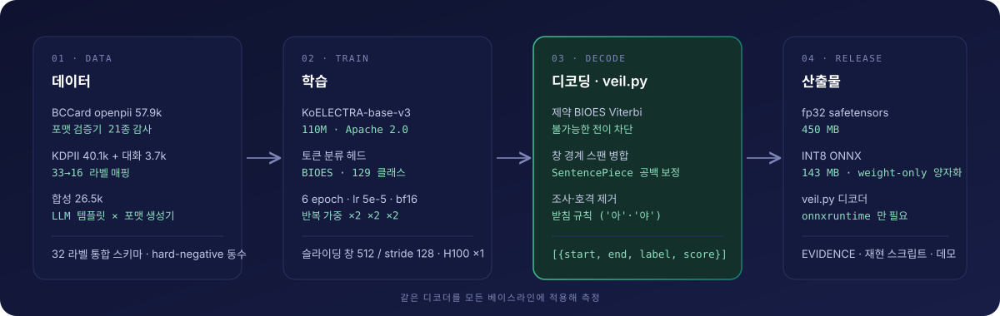

# Veil-PII-Ko-Lite

한국어·영어 개인정보 탐지용 토큰 분류 모델. KoELECTRA-base-v3 (110M) 를 32 라벨로 파인튜닝했고 INT8 ONNX(143MB)로 CPU 단독 추론한다.

- 모델 가중치: [GitHub Releases](https://github.com/WontaeKim89/veil-pii-ko-lite/releases) 또는 **https://huggingface.co/1T/veil-pii-ko-lite** (fp32 safetensors + INT8 ONNX)
- 도커 이미지: **https://hub.docker.com/r/zzang9680/veil-pii** — `slim` · `presidio`, amd64/arm64
- 근거표·측정 조건: [`release/EVIDENCE.md`](release/EVIDENCE.md) · 모델 카드: [`release/MODEL_CARD.md`](release/MODEL_CARD.md)
- 4개 모델 비교 데모: [`playground/`](playground/) — Azure VM 배포본, 가동 중이면 `https://20-249-59-7.sslip.io`

| 벤치 (문자 오프셋 exact-match span F1) | n | Veil fp32 | Veil INT8 | BCCard 1.4B | FrameByFrame 1.4B | Azure AI Language |
|---|---:|---:|---:|---:|---:|---:|
| KDPII test (실제 대화체) | 4,891 | **0.9339** | 0.9342 | 0.4533 | 0.5156 | 0.4631 |
| KDPII test · 대화 단위 | 458 | **0.9423** | 0.9433 | 0.4661 | — | 0.4626 |
| BCCard validation · ko | 10,743 | **0.9826** | 0.9824 | 0.9594 | — | 0.4031 |
| BCCard validation · en | 3,781 | **0.9700** | 0.9632 | 0.9653 | — | 0.5295 |
| 합성 heldout v2 | 670 | **0.9652** | 0.9643 | 0.5328 | — | 0.5035 |

---

## 1. 개발 목표와 결과

| 목표 | 정량 기준 | 결과 |
|---|---|---|
| 정확도 | 한국어 PII 벤치에서 SoTA 수준의 스코어 확보 | **달성** |
| 경량성 | ≤150M 파라미터, ≤150MB 배포 파일, 무손실 INT8 | **달성** — 110M · 143MB · 무손실 |
| 카테고리 | 현재 배포된 모든 한국어 PII에서 탐지하는 카테고리를 대부분 포함할 것  | **달성** — 32종 (VEHICLE_PLATE · SUBSCRIBER_ID · DEVICE_SERIAL 추가) |
| 지연시간 | 4 vCPU · 512 토큰 ≤ 40ms | **미달** — INT8 237ms (128 토큰 61ms, 16 스레드 108ms) |


## 2. 시스템 구성

<p align="center"></p>

## 3. 백본 선택

후보 모델을 동일 데이터(clean 셋)·동일 하이퍼파라미터·2 epoch 조건으로 학습해 비교했다.

| 백본 | 파라미터 | 라이선스 | KDPII test F1 | BCCard val F1 | 판정 |
|---|---:|---|---:|---:|---|
| **monologg/koelectra-base-v3** | 110M | Apache 2.0 | **0.8789** | 0.9613 | **채택** — 가장 작고 KDPII 최상위 |
| kakaobank/kf-deberta-base | 185M | MIT | 0.8798 | 0.9661 | +0.1~0.5pt 이나 INT8 245MB 로 크기 목표 초과 |
| lucid/deberta-v3-base-korean | 185M | Apache 2.0 | 0.8533 | 0.9527 | 탈락 |
| beomi/KcELECTRA-base | 110M | MIT | KoELECTRA 하회 | | 탈락 |
| microsoft/mdeberta-v3-base | 276M | MIT | exact 0.39 → 오프셋 보정 후 회복 | | 탈락 — 크기 2.5배, SentencePiece 선행공백 오프셋 문제 |
| klue/roberta-base | 110M | CC-BY-SA | 미실험 | | SA 조항으로 사전 제외 |


## 4. 학습 데이터

| 출처 | 규모 | 수집 사유 | 처리 |
|---|---:|---|---|
| BCCard/privacy-filter-openpii-masking (CC-BY-4.0) | 72.4k 행 | 한국어 PII 29 라벨이 정의된 가장 큰 공개 데이터. 비교 대상과 같은 분포 | 21종 포맷 검증기로 감사 — `openpii-1.5m-ko` 는 35% 불량(운전면허 61%가 랜덤 대문자열, 이름 13%가 혼합 문자). clean/full 두 벌 구성 |
| KDPII (CC-BY-4.0, IEEE Access 2024) | 40k 문장 · 3,664 대화 | 실제 구어체 기반 유일한 한국어 PII 실데이터, 공식 분할 | 33→16 라벨 매핑, 카드·계좌 스팬 숫자 구간 정규화, 대화 단위 장문 표본 별도 구성 |
| 합성 (자체) | 26.5k 행 | 공개 데이터에 없는 라벨(차량번호·가입번호·단말 S/N)과 부족 도메인(금융·통신·보험) 보강, hard-negative 로 과탐 억제 | vLLM(gemma-4-12b-it)·Azure OpenAI 로 20 장르×7 문체 플레이스홀더 템플릿 ~4,700개 → 한국 포맷 정확 생성기(주민번호 2020-10 전후 분포, 카드 Luhn, 사업자번호 체크섬)로 채움. heldout 은 템플릿 해시 고정. 실명·실번호 무포함 |


## 5. 학습 방식

- 토큰 분류(BIOES), 32 라벨 × 4 + O = 129 클래스. 불가능한 전이를 차단하는 제약 Viterbi 디코딩.
- 최대 512 토큰 슬라이딩 창, stride 128, 창 경계 스팬은 후처리에서 병합.
- 최종 v4: 6 epoch · lr 5e-5 · batch 32 · bf16 · label smoothing 0 · 반복 가중 BCCard×2 KDPII×2 합성×2 · H100 1장 약 40분.
- 평가: 문자 오프셋 exact-match span F1(micro) 기본, partial F1 병기. 베이스라인은 "그 모델이 아는 라벨 한정" F1 도 별도 계산.
- 양자화: ONNX Runtime `MatMulNBits` weight-only INT8(block 128) + 임베딩 fp16.

## 6. 양자화 · 지연시간

| 변형 | 크기 | KDPII F1 | 4스레드 128 / 512 tok | 16스레드 512 tok |
|---|---:|---:|---:|---:|
| fp32 ONNX | 450MB | 0.9339 | 77 / 274 ms | 118 ms |
| 동적 INT8 | 113MB | ~0.80 | 25 / 95 ms | 58 ms |
| **weight-only INT8 + fp16 emb (공개본)** | **143MB** | **0.9342** | 61 / 237 ms | 108 ms |
| weight-only INT4 + fp16 emb (실험) | 100MB | 0.9321 | 67 / 261 ms | 119 ms |


---

## 컨테이너로 실행

가중치가 이미지에 포함되어 있어 별도 설치나 네트워크 없이 기동한다.

```bash
docker run -d -p 8080:8080 --name veil zzang9680/veil-pii:slim

curl -s localhost:8080/detect -H 'Content-Type: application/json' \
  -d '{"text":"담당자 김철수(010-1234-5678)에게 문의. 주민번호 900101-1234567"}'
# {"spans":[{"start":4,"end":7,"label":"PERSON","score":0.9999}, ...],
#  "ms":14, "summary":{"total":3,"by_label":{...},"sensitive":1}}
```

### 이미지 태그

| 태그 | 크기(압축) | 내용 |
|---|---:|---|
| `slim` | 235 MB | 탐지 + 익명화 3종. 기본 |
| `presidio` | 300 MB | `slim` + Presidio 어댑터·Anonymizer 연산자 |

버전 고정이 필요하면 `slim-1.0.0` · `presidio-1.0.0` 을, 아키텍처를 직접 지정하려면 `*-amd64` · `*-arm64` 를 쓴다.
기본 태그는 amd64·arm64 멀티 아키텍처 매니페스트이므로 pull 시 실행 환경에 맞는 이미지가 선택된다.
두 이미지의 탐지 결과는 동일하다. Presidio 는 추론에 관여하지 않고 익명화 연산자와 표준 인터페이스만 제공한다.

```bash
docker run -d -p 8080:8080 zzang9680/veil-pii:presidio
curl -s localhost:8080/healthz    # {"presidio": true, ...} 이면 Presidio 이미지
```

### 엔드포인트

| 메서드 | 경로 | 설명 |
|---|---|---|
| POST | `/detect` | `{"text": "...", "threshold": 0.0}` → 스팬 목록 + 감사 요약 |
| POST | `/mask` | `{"text": "...", "policy": "default\|hash\|partial"}` |
| POST | `/batch` | 여러 건 한 번에 |
| GET | `/healthz` `/labels` `/docs` | 상태 · 라벨 32종 · OpenAPI |

### 마스킹 정책

```bash
curl -s localhost:8080/mask -H 'Content-Type: application/json' \
  -d '{"text":"김철수 010-1234-5678, 주민번호 900101-1234567","policy":"partial"}'
```

| policy | 결과 |
|---|---|
| `default` | `[PERSON] [PHONE], 주민번호 [RRN]` |
| `hash` | `[PERSON:2f105e5921] [PHONE:126697a64a] …` — 동일 값은 동일 토큰 |
| `partial` | `김*수 010-****-5678, 주민번호 900101-*******` |

`hash` 정책은 `-e VEIL_HASH_SALT=...` 로 salt 를 고정해야 한다. 지정하지 않으면 재기동마다 토큰이 달라진다.
그 밖에 `VEIL_THREADS`(기본 4), `VEIL_MAX_CHARS`(20000), `VEIL_MODEL_DIR` 을 환경변수로 조정한다.

입력 원문은 로그에 기록하지 않는다. 컨테이너는 비루트(uid 10001)로 실행되며 `--read-only --tmpfs /tmp` 환경에서도 기동한다.
폐쇄망 반입 절차는 [`docker/OFFLINE.md`](docker/OFFLINE.md) 에 정리했다.

### Presidio 어댑터

```bash
docker run -d -p 8080:8080 -e VEIL_HASH_SALT=my-secret --name veil zzang9680/veil-pii:presidio
curl -s localhost:8080/healthz      # {"presidio": true, ...}
```

REST 응답은 `slim` 과 동일하다. 같은 입력에 대해 스팬은 물론 `hash` 정책의 토큰 값까지 일치한다.
HTTP 로만 사용한다면 `slim` 으로 충분하며, 아래 세 가지가 필요한 경우에만 `presidio` 를 선택한다.

**1) Presidio 표준 엔티티 타입** — 기존 Presidio 파이프라인에 그대로 연결된다.

```bash
docker exec veil python -c "from veil_pii.presidio import build_analyzer; t='담당자 김철수(010-1234-5678)에게 문의. 주민번호 900101-1234567'; [print(' ', r.entity_type, t[r.start:r.end], round(r.score,4)) for r in build_analyzer().analyze(text=t, language='ko')]"
```
```
PERSON 김철수 0.9999
KR_RRN 900101-1234567 0.9999
PHONE_NUMBER 010-1234-5678 0.9998
```

라벨은 `PHONE` → `PHONE_NUMBER`, `RRN` → `KR_RRN`, `CARD_NUMBER` → `CREDIT_CARD` 로 변환되며 `PERSON` 은 그대로 유지된다.

**2) Anonymizer 연산자 연동**

```bash
docker exec veil python -c "
from veil_pii.presidio import build_analyzer,build_anonymizer,get_operators
t='담당자 김철수(010-1234-5678)에게 문의. 주민번호 900101-1234567'
r=build_analyzer().analyze(text=t,language='ko'); a=build_anonymizer()
[print(' ',p,'→',a.anonymize(text=t,analyzer_results=r,operators=get_operators(p)).text) for p in ('default','partial')]"
```
```
default → 담당자 <PERSON>(<PHONE_NUMBER>)에게 문의. 주민번호 <KR_RRN>
partial → 담당자 김*수(010-****-5678)에게 문의. 주민번호 900101-*******
```

`default`·`hash` 의 출력 표기는 REST 와 다르다(꺾쇠 기호, 전체 SHA-256). `partial` 만 REST 와 자릿수 규칙을 일치시켰다. 두 경로의 부분 마스킹 결과가 달라지면 감사 대조가 성립하지 않기 때문이다.

**3) 암호화와 복호화** — `hash` 는 단방향이지만 이 경로는 키로 원문을 복원한다.

```bash
docker exec veil python -c "
from veil_pii.presidio import build_analyzer,build_anonymizer
from presidio_anonymizer import DeanonymizeEngine
from presidio_anonymizer.entities import OperatorConfig
K='0123456789abcdef0123456789abcdef'
t='담당자 김철수(010-1234-5678)에게 문의'
r=build_analyzer().analyze(text=t,language='ko')
e=build_anonymizer().anonymize(text=t,analyzer_results=r,operators={'DEFAULT':OperatorConfig('encrypt',{'key':K})})
d=DeanonymizeEngine().deanonymize(text=e.text,entities=e.items,operators={'DEFAULT':OperatorConfig('decrypt',{'key':K})})
print('  암호화:',e.text[:60]+'...'); print('  복원  :',d.text); print('  일치  :',d.text==t)"
```
```
암호화: 담당자 WHnGFEeh6SPjpDAMopkC8HmMpQpq4-lh2SaQtety-5w=(x1x5LIYXwth...
복원  : 담당자 김철수(010-1234-5678)에게 문의
일치  : True
```

두 이미지의 실측 비교(Apple Silicon, 74자 문장 20회):

| | slim | presidio |
|---|---:|---:|
| 기동 | 407 ms | 269 ms |
| 탐지(중앙값) | 13 ms | 13 ms |
| 메모리 | 304 MB | 360 MB |
| 이미지(압축) | 235 MB | 300 MB |

탐지 속도는 동일하고 메모리만 56MB 더 소요된다.

> zsh 에서 `<<'PY'` 형태의 heredoc 을 여러 줄로 붙여 넣으면 `zsh: bad pattern: [200~docker` 가 발생할 수 있다.
> 터미널의 bracketed paste 제어문자가 입력에 섞이기 때문이다. 위 예시는 `python -c "..."` 단일 구문이라 해당하지 않는다.
> heredoc 이 필요하면 `docker exec -i veil python < script.py` 로 파일을 전달하거나(`-i` 가 없으면 출력이 비어 있다),
> 붙여 넣기 전에 `printf '\e[?2004l'` 로 제어문자를 비활성화한다.

확인이 끝나면 `docker rm -f veil` 로 컨테이너를 제거한다.

## Python 패키지

가중치는 두 경로로 배포한다. 어느 쪽을 받든 `release/` 의 `config.json`·토크나이저·`veil.py` 와 함께 사용한다.

```bash
git clone https://github.com/WontaeKim89/veil-pii-ko-lite && cd veil-pii-ko-lite
pip install onnxruntime transformers numpy

# 1) GitHub Releases (Hugging Face 불필요) — INT8 ONNX 143MB. --fp32 지정 시 safetensors 450MB 포함
bash scripts/download_weights.sh release            # → release/model.int8.onnx
# 2) 또는 Hugging Face
hf download 1T/veil-pii-ko-lite model.int8.onnx --local-dir release
```

```python
import sys; sys.path.insert(0, "release")
from veil import Veil
det = Veil("release/model.int8.onnx", tokenizer_dir="release")
det.predict("담당자 김철수(010-1234-5678)에게 문의")
# [{'start': 4, 'end': 7, 'label': 'PERSON', 'score': 0.9999}, {'start': 8, 'end': 21, 'label': 'PHONE', 'score': 0.9999}]
det.mask("담당자 김철수(010-1234-5678)에게 문의")   # '담당자 [PERSON]([PHONE])에게 문의'
```

가중치를 저장소에 직접 두지 않은 이유는 용량 제약이다. GitHub 는 파일당 100MB 를 넘으면 push 를 거부하고 LFS 는 대역폭 과금이 붙는다. Releases 자산은 파일당 2GB 까지 무료다.

## 저장소 구조

| 경로 | 내용 |
|---|---|
| `data/` | 공개 데이터 감사(`audit.py`)·통합(`unify.py`)·합성(`synth_templates.py`, `synth_fill.py`, `gen_entities.py`, `validators.py`) |
| `train/` | HF Trainer 학습, BIOES 라벨, 제약 Viterbi 디코더(`viterbi.py`) |
| `eval/` | 스코어러(`span_f1.py`), 베이스라인 평가(`eval_bccard.py`, `eval_framebyframe.py`, `eval_azure_pii.py`), 보고서 생성 |
| `export/` | ONNX 변환, weight-only INT8/INT4, fp16 임베딩, 민감도 탐색 |
| `release/` | 공개 자산: `veil.py`, 라벨 스키마, 모델 카드, EVIDENCE, 재현 스크립트 (가중치는 HF) |
| `playground/` | 4개 모델 동시 비교 데모 (FastAPI + docker compose + Caddy, Azure VM 배포 스크립트) |
| `scripts/` | VM 학습·평가·패키징·HF 업로드 |

## 재현

```bash
pip install -r scripts/requirements-repro.txt
bash scripts/reproduce_claims.sh release   # 공개 데이터 수집 → Veil INT8/fp32 · BCCard 베이스라인 평가 → 결과표 (CPU 8스레드 약 40분)
```

## 라이선스 및 출처

Apache 2.0. 학습 데이터 BCCard/privacy-filter-openpii-masking (CC-BY-4.0) · KDPII (CC-BY-4.0, Fei·Kang et al., IEEE Access 2024) · 자체 합성.
백본 monologg/koelectra-base-v3-discriminator (Apache 2.0). 비교 대상 BCCard/MoAI-Privacy-Filter-INT8, FrameByFrame/privacy-filter-korean (Apache 2.0), Azure AI Language PII (API 2024-11-01).
