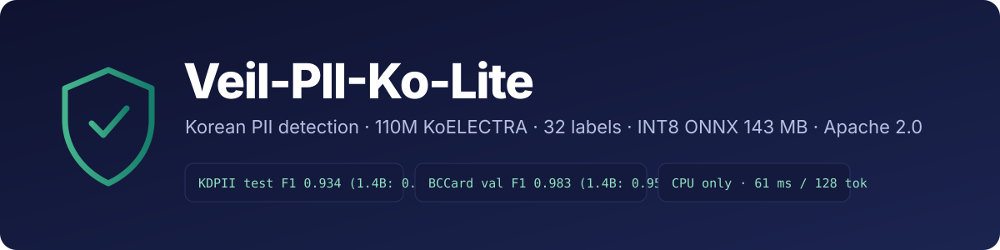

<div align="center">



CPU환경에서 빠르게 구동이 가능한 한국어 개인정보 탐지용 토큰 분류 모델입니다.

</div>

- 모델 가중치: **https://huggingface.co/1T/veil-pii-ko-lite** · [GitHub Releases](https://github.com/WontaeKim89/veil-pii-ko-lite/releases)
- 도커 이미지: **https://hub.docker.com/r/zzang9680/veil-pii** — `slim` · `presidio`, amd64/arm64
- 합성 데이터: **https://huggingface.co/datasets/1T/veil-pii-ko-synth** — 학습에 쓴 합성 26,875행 · heldout 670행 · 템플릿
- 평가셋: **https://huggingface.co/datasets/1T/veil-pii-ko-stress** — 표기 변형·문서 길이·누수 점검 분할

| 벤치 | n | Veil fp32 | Veil INT8 | BCCard 1.4B | FrameByFrame 1.4B | Azure AI Language |
|---|---:|---:|---:|---:|---:|---:|
| KDPII test | 4,891 | **0.9339** | 0.9327 | 0.4533 | 0.5156 | 0.4631 |
| KDPII test · 대화 단위 | 458 | **0.9423** | 0.9420 | 0.4661 | — | 0.4626 |
| BCCard validation · ko | 10,743 | **0.9826** | 0.9825 | 0.9594 | — | 0.4031 |
| BCCard validation · en | 3,781 | **0.9700** | 0.9697 | 0.9653 | — | 0.5295 |
| 합성 heldout v2 | 670 | **0.9652** | 0.9643 | 0.5328 | — | 0.5035 |

엔티티 단위 exact match F1(micro). 예측 스팬의 시작·끝 위치와 라벨이 모두 맞아야 정답으로 센다.
모든 모델에 같은 스코어러와 같은 디코더를 적용했다. 라벨별 수치는 [`release/PER_LABEL.md`](release/PER_LABEL.md),
측정 조건은 [`release/EVIDENCE.md`](release/EVIDENCE.md) 참고.

## Quickstart

가중치는 두 곳에서 받을 수 있다. 어디서 받든 `release/` 의 `config.json`·토크나이저·`veil.py` 가 같이 있어야 한다.

```bash
git clone https://github.com/WontaeKim89/veil-pii-ko-lite && cd veil-pii-ko-lite
pip install onnxruntime transformers numpy

# 1) GitHub Releases (Hugging Face 불필요) — INT8 ONNX 143MB. --fp32 지정 시 safetensors 450MB 포함
bash scripts/download_weights.sh release            # → release/model.int8.onnx
# 2) 또는 Hugging Face
hf download 1T/veil-pii-ko-lite model.int8.onnx --local-dir release
```

```python
import sys; sys.path.insert(0, "release")
from veil import Veil
det = Veil("release/model.int8.onnx", tokenizer_dir="release")
det.predict("담당자 김철수(010-1234-5678)에게 문의")
# [{'start': 4, 'end': 7, 'label': 'PERSON', 'score': 0.9999}, {'start': 8, 'end': 21, 'label': 'PHONE', 'score': 0.9999}]
det.mask("담당자 김철수(010-1234-5678)에게 문의")   # '담당자 [PERSON]([PHONE])에게 문의'
```

가중치를 레포에 직접 넣지 않은 건 용량 때문이다. GitHub 는 파일당 100MB 를 넘으면 push 가 막히고 LFS 는 대역폭 과금이 붙는다. Releases 자산은 파일당 2GB 까지 무료다.

## Docker

가중치가 이미지에 들어 있어 네트워크 없이 바로 뜬다.

```bash
docker run -d -p 8080:8080 --name veil zzang9680/veil-pii:slim

curl -s localhost:8080/detect -H 'Content-Type: application/json' \
  -d '{"text":"담당자 김철수(010-1234-5678)에게 문의. 주민번호 900101-1234567"}'
# {"spans":[{"start":4,"end":7,"label":"PERSON","score":0.9999}, ...],
#  "ms":14, "summary":{"total":3,"by_label":{...},"sensitive":1}}
```

### Tags

| 태그 | 크기(압축) | 내용 |
|---|---:|---|
| `slim` | 235 MB | 탐지 + 익명화 3종. 기본 |
| `presidio` | 300 MB | `slim` + Presidio 어댑터·Anonymizer 연산자 |

버전을 고정하려면 `slim-1.0.0` · `presidio-1.0.0`, 아키텍처를 직접 고르려면 `*-amd64` · `*-arm64` 를 쓴다.
기본 태그는 멀티 아키텍처 매니페스트라 pull 하면 환경에 맞는 이미지가 붙는다.
두 이미지의 탐지 결과는 같다. Presidio 는 추론에 끼지 않고 익명화 연산자와 표준 인터페이스만 얹는다.

```bash
docker run -d -p 8080:8080 zzang9680/veil-pii:presidio
curl -s localhost:8080/healthz    # {"presidio": true, ...} 이면 Presidio 이미지
```

### Endpoints

| 메서드 | 경로 | 설명 |
|---|---|---|
| POST | `/detect` | `{"text": "...", "threshold": 0.0}` → 스팬 목록 + 감사 요약 |
| POST | `/mask` | `{"text": "...", "policy": "default\|hash\|partial"}` |
| POST | `/batch` | 여러 건 한 번에 |
| GET | `/healthz` `/labels` `/docs` | 상태 · 라벨 32종 · OpenAPI |

### Masking Policies

```bash
curl -s localhost:8080/mask -H 'Content-Type: application/json' \
  -d '{"text":"김철수 010-1234-5678, 주민번호 900101-1234567","policy":"partial"}'
```

| policy | 결과 |
|---|---|
| `default` | `[PERSON] [PHONE], 주민번호 [RRN]` |
| `hash` | `[PERSON:2f105e5921] [PHONE:126697a64a] …` — 동일 값은 동일 토큰 |
| `partial` | `김*수 010-****-5678, 주민번호 900101-*******` |

`hash` 정책은 `-e VEIL_HASH_SALT=...` 로 salt 를 고정해야 한다. 안 주면 재기동할 때마다 토큰이 달라진다.
그 밖에 `VEIL_THREADS`(기본 4), `VEIL_MAX_CHARS`(20000), `VEIL_MODEL_DIR` 을 환경변수로 바꿀 수 있다.

입력 원문은 로그에 남기지 않는다. 컨테이너는 비루트(uid 10001)로 돌고 `--read-only --tmpfs /tmp` 에서도 뜬다.
폐쇄망 반입 절차는 [`docker/OFFLINE.md`](docker/OFFLINE.md) 에 정리했다.

### Presidio Adapter

```bash
docker run -d -p 8080:8080 -e VEIL_HASH_SALT=my-secret --name veil zzang9680/veil-pii:presidio
curl -s localhost:8080/healthz      # {"presidio": true, ...}
```

REST 응답은 `slim` 과 같다. 같은 입력이면 스팬도, `hash` 정책의 토큰 값도 동일하다.
HTTP 로만 쓸 거면 `slim` 이면 된다. 아래 세 가지가 필요할 때만 `presidio` 를 쓴다.

**1) Presidio 표준 엔티티 타입** — 쓰던 Presidio 파이프라인에 그대로 꽂힌다.

```bash
docker exec veil python -c "from veil_pii.presidio import build_analyzer; t='담당자 김철수(010-1234-5678)에게 문의. 주민번호 900101-1234567'; [print(' ', r.entity_type, t[r.start:r.end], round(r.score,4)) for r in build_analyzer().analyze(text=t, language='ko')]"
```
```
PERSON 김철수 0.9999
KR_RRN 900101-1234567 0.9999
PHONE_NUMBER 010-1234-5678 0.9998
```

라벨은 `PHONE` → `PHONE_NUMBER`, `RRN` → `KR_RRN`, `CARD_NUMBER` → `CREDIT_CARD` 로 바뀌고 `PERSON` 은 그대로다.

**2) Anonymizer 연산자 연동**

```bash
docker exec veil python -c "
from veil_pii.presidio import build_analyzer,build_anonymizer,get_operators
t='담당자 김철수(010-1234-5678)에게 문의. 주민번호 900101-1234567'
r=build_analyzer().analyze(text=t,language='ko'); a=build_anonymizer()
[print(' ',p,'→',a.anonymize(text=t,analyzer_results=r,operators=get_operators(p)).text) for p in ('default','partial')]"
```
```
default → 담당자 <PERSON>(<PHONE_NUMBER>)에게 문의. 주민번호 <KR_RRN>
partial → 담당자 김*수(010-****-5678)에게 문의. 주민번호 900101-*******
```

`default`·`hash` 는 표기가 REST 와 다르다(꺾쇠 기호, 전체 SHA-256). `partial` 만 REST 와 자릿수 규칙을 맞춰 뒀다. 두 경로의 결과가 어긋나면 감사 때 대조가 안 된다.

**3) 암호화·복호화** — `hash` 는 단방향이지만 이쪽은 키로 원문을 되살린다.

```bash
docker exec veil python -c "
from veil_pii.presidio import build_analyzer,build_anonymizer
from presidio_anonymizer import DeanonymizeEngine
from presidio_anonymizer.entities import OperatorConfig
K='0123456789abcdef0123456789abcdef'
t='담당자 김철수(010-1234-5678)에게 문의'
r=build_analyzer().analyze(text=t,language='ko')
e=build_anonymizer().anonymize(text=t,analyzer_results=r,operators={'DEFAULT':OperatorConfig('encrypt',{'key':K})})
d=DeanonymizeEngine().deanonymize(text=e.text,entities=e.items,operators={'DEFAULT':OperatorConfig('decrypt',{'key':K})})
print('  암호화:',e.text[:60]+'...'); print('  복원  :',d.text); print('  일치  :',d.text==t)"
```
```
암호화: 담당자 WHnGFEeh6SPjpDAMopkC8HmMpQpq4-lh2SaQtety-5w=(x1x5LIYXwth...
복원  : 담당자 김철수(010-1234-5678)에게 문의
일치  : True
```

두 이미지 실측(Apple Silicon, 74자 문장 20회):

| | slim | presidio |
|---|---:|---:|
| 기동 | 407 ms | 269 ms |
| 탐지(중앙값) | 13 ms | 13 ms |
| 메모리 | 304 MB | 360 MB |
| 이미지(압축) | 235 MB | 300 MB |

탐지 속도는 같고 메모리만 56MB 더 쓴다.

> zsh 에서 `<<'PY'` 형태의 heredoc 을 여러 줄로 붙여 넣으면 `zsh: bad pattern: [200~docker` 가 발생할 수 있다.
> 터미널의 bracketed paste 제어문자가 입력에 섞이기 때문이다. 위 예시는 `python -c "..."` 단일 구문이라 해당하지 않는다.
> heredoc 이 필요하면 `docker exec -i veil python < script.py` 로 파일을 전달하거나(`-i` 가 없으면 출력이 비어 있다),
> 붙여 넣기 전에 `printf '\e[?2004l'` 로 제어문자를 비활성화한다.

다 봤으면 `docker rm -f veil` 로 지운다.

## Model details

| | |
|---|---|
| 백본 | [monologg/koelectra-base-v3-discriminator](https://huggingface.co/monologg/koelectra-base-v3-discriminator) (110M, Apache 2.0) |
| 태스크 | 토큰 분류 — BIOES, 32 라벨 × 4 + O = 129 클래스 |
| 디코딩 | 불가능한 태그 전이를 막는 제약 Viterbi. 512 토큰 슬라이딩 창(stride 128), 창 경계 스팬은 병합 |
| 최대 입력 | 512 토큰. 더 길면 창을 나눠 처리하므로 문서 길이 제한은 없다 |
| 언어 | 한국어 중심. 영어도 학습·평가에 포함 |

### Quantization & latency

| 변형 | 크기 | KDPII F1 | 4스레드 128 / 512 tok | 16스레드 512 tok |
|---|---:|---:|---:|---:|
| fp32 ONNX | 450MB | 0.9339 | 77 / 274 ms | 118 ms |
| **weight-only INT8 + fp16 emb (공개본)** | **143MB** | **0.9327** | 61 / 237 ms | 108 ms |
| weight-only INT4 + fp16 emb (실험) | 100MB | 0.9321 | 67 / 261 ms | 119 ms |
| 동적 INT8 (activation 도 INT8) | 113MB | −4.5pt | 25 / 95 ms | 58 ms |

가중치만 INT8 로 낮추고 activation 은 fp32 로 뒀다. 동적 INT8 은 2.5배 빠르지만 재현율이 8pt 넘게 떨어져 쓰지 않았다.
측정 환경은 Xeon Platinum 8480C, ONNX Runtime CPU. 스레드 수는 `intra_op_num_threads` 값이다.

### Labels (32)

| 그룹 | 라벨 |
|---|---|
| 사람·조직 | `PERSON` `ORGANIZATION` `USER_ID` |
| 연락처·위치 | `PHONE` `EMAIL` `ADDRESS` `ZIPCODE` `URL` `IPADDRESS` `MACADDRESS` `PORT` |
| 한국 신원 식별자 | `RRN` `FRN` `CI` `IPIN` `PASSPORT` `DRIVER_LICENSE` `BUSINESS_ID` `SSN` |
| 금융 | `CARD_NUMBER` `CARD_EXPIRY` `CVC` `VIRTUAL_CARD_NUMBER` `ACCOUNT_NUMBER` `TRANSACTION_APPROVAL_ID` |
| 기기·가입 | `IMEI` `DEVICE_SERIAL` `SUBSCRIBER_ID` `VEHICLE_PLATE` |
| 기타 | `DATE` `GENERIC_ID` `SECRET` |

## Training data

| 출처 | 규모 | 라이선스 |
|---|---:|---|
| [BCCard/privacy-filter-openpii-masking](https://huggingface.co/datasets/BCCard/privacy-filter-openpii-masking) | 72.4k 행 | CC-BY-4.0 |
| KDPII (Fei·Kang et al., IEEE Access 2024) | 40k 문장 · 3,664 대화 | CC-BY-4.0 |
| [1T/veil-pii-ko-synth](https://huggingface.co/datasets/1T/veil-pii-ko-synth) (자체 합성) | 26.9k 행 | Apache 2.0 |

공개 데이터에 없는 라벨(차량번호·가입번호·단말 S/N)과 부족한 도메인을 합성 데이터로 채웠다.
실명이나 실제 번호는 쓰지 않았고, 주민번호·카드번호·사업자번호는 체크섬까지 맞는 생성기로 만들었다.
합성 데이터는 학습에 들어간 행 그대로 공개했다. 문장은 LLM 으로 템플릿을 뽑고, 값은 규칙 기반 생성기로 채웠다.
학습 데이터 감사와 합성 코드는 `data/` 에 있다.

## Evaluation data

표기 변형과 문서 길이를 바꿔 가며 어디서 무너지는지 보려고 만든 평가셋을 따로 공개했다 —
[**1T/veil-pii-ko-stress**](https://huggingface.co/datasets/1T/veil-pii-ko-stress).

| 구성 | 내용 | 행 |
|---|---|---:|
| `stress` | 하이픈→점·공백, 구분자 제거, 전각 숫자, 글자 사이 공백 6종 + 각 대조군 | 5,376 |
| `longdoc` | 같은 정답 스팬(1,604)을 유지한 채 길이만 200~3,000자로 늘린 문서 | 1,301 |
| `leakage` | KDPII train/test 중복을 뺀 분할과 중복 행만 모은 분할 | 9,782 |

정답 스팬은 그대로 두고 표면형만 바꿔 오프셋을 다시 계산했다. 사람이 라벨을 다시 달 필요가 없어
값이 곧 원본 대비 하락폭이다. 원문은 KDPII(CC-BY-4.0) 이고, 변형 설계와 분할 정의가 이 저장소 몫이다.
`eval/make_stress.py` 와 `eval/leakage_check.py` 로 다시 만들 수 있다.

## Reproduce

```bash
pip install -r scripts/requirements-repro.txt
bash scripts/reproduce_claims.sh release   # 공개 데이터 수집 → Veil INT8/fp32 · BCCard 베이스라인 평가 → 결과표 (CPU 8스레드 약 40분)
```

## Repository Layout

| 경로 | 내용 |
|---|---|
| `data/` | 공개 데이터 감사(`audit.py`)·통합(`unify.py`)·합성(`synth_templates.py`, `synth_fill.py`, `gen_entities.py`, `validators.py`) |
| `train/` | HF Trainer 학습, BIOES 라벨, 제약 Viterbi 디코더(`viterbi.py`) |
| `eval/` | 스코어러(`span_f1.py`), 베이스라인 평가(`eval_bccard.py`, `eval_framebyframe.py`, `eval_azure_pii.py`), 보고서 생성 |
| `export/` | ONNX 변환, weight-only INT8/INT4, fp16 임베딩, 민감도 탐색 |
| `release/` | 공개 자산: `veil.py`, 라벨 스키마, 모델 카드, EVIDENCE, 재현 스크립트 (가중치는 HF) |
| `scripts/` | VM 학습·평가·패키징·HF 업로드 |

## Citation

```bibtex
@misc{veil-pii-ko-lite-2026,
  title  = {Veil-PII-Ko-Lite: a 110M Korean PII detector with 32 labels},
  author = {Kim, Wontae},
  year   = {2026},
  url    = {https://huggingface.co/1T/veil-pii-ko-lite}
}
```

## License

Apache 2.0. 학습 데이터 BCCard/privacy-filter-openpii-masking (CC-BY-4.0) · KDPII (CC-BY-4.0, Fei·Kang et al., IEEE Access 2024) · 자체 합성.
백본 monologg/koelectra-base-v3-discriminator (Apache 2.0). 비교 대상 BCCard/MoAI-Privacy-Filter-INT8, FrameByFrame/privacy-filter-korean (Apache 2.0), Azure AI Language PII (API 2024-11-01).
