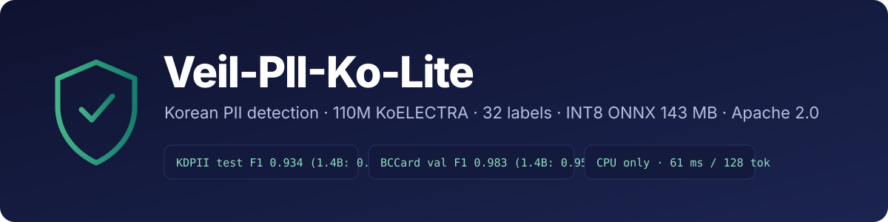

---
language:
  - ko
  - en
license: apache-2.0
library_name: transformers
pipeline_tag: token-classification
base_model: monologg/koelectra-base-v3-discriminator
tags:
  - pii
  - ner
  - korean
  - privacy
  - onnx
  - int8
  - koelectra
  - token-classification
datasets:
  - BCCard/privacy-filter-openpii-masking
metrics:
  - f1
widget:
  - text: "담당자 김철수(010-1234-5678)에게 문의해 주세요. 계좌는 국민은행 123456-04-567890 입니다."
    example_title: "상담 문장"
  - text: "배송지: 경기도 성남시 분당구 판교역로 235 에이치스퀘어 N동 7층, 받는 분 이영희, 연락처 031-123-4567"
    example_title: "배송 주소"
  - text: "Hi, this is Sarah Kim from Hanwha Life. 여권번호 M12345678 로 예약 부탁드립니다."
    example_title: "한영 혼합"
model-index:
  - name: Veil-PII-Ko-Lite
    results:
      - task:
          type: token-classification
          name: PII detection (span exact-match)
        dataset:
          name: KDPII test
          type: kdpii
          split: test
        metrics:
          - type: f1
            name: exact-match span F1 (micro)
            value: 0.9339
      - task:
          type: token-classification
          name: PII detection (span exact-match)
        dataset:
          name: BCCard/privacy-filter-openpii-masking (validation, ko)
          type: BCCard/privacy-filter-openpii-masking
          split: validation
        metrics:
          - type: f1
            name: exact-match span F1 (micro)
            value: 0.9826
      - task:
          type: token-classification
          name: PII detection (span exact-match)
        dataset:
          name: BCCard/privacy-filter-openpii-masking (validation, en)
          type: BCCard/privacy-filter-openpii-masking
          split: validation
        metrics:
          - type: f1
            name: exact-match span F1 (micro)
            value: 0.9700
---

<div align="center">



한국어 개인정보 탐지용 토큰 분류 모델. KoELECTRA-base-v3 (110M) 를 32 라벨로 파인튜닝했고, INT8 ONNX 로 CPU 에서 돌아간다.

[](#라이선스--고지)
[](#파일)
[](https://github.com/WontaeKim89/veil-pii-ko-lite)

</div>

---

## 개요

사내 LLM 에이전트 앞단에 붙일 개인정보 마스킹용으로 만들었다. 폐쇄망 CPU 에서 돌아야 했고, 주민번호·사업자번호·CI 같은 한국 식별자와 이름·주소 같은 문맥 항목을 한 모델이 다 잡아야 했다. 공개된 후보(BCCard MoAI-Privacy-Filter, FrameByFrame, Azure AI Language PII, Presidio)는 크기·라벨 범위·한국어 실문장 성능 중 하나씩이 비어 있어서 직접 학습했다.

- 라벨 32종. BCCard 29종에 차량번호·가입번호·단말 S/N 을 더했다.
- `veil.py` 에 제약 BIOES Viterbi, 슬라이딩 창 병합, 조사 제거가 들어 있어 `[{start, end, label, score}]` 를 바로 돌려준다. `torch` 없이 `onnxruntime` 만 있으면 된다.
- 베이스라인은 전부 같은 스코어러·같은 디코더로 다시 쟀고, 아래 재현 절차로 다시 계산할 수 있다.

## 벤치마크

문자 오프셋 exact-match span F1 (micro). 모든 모델을 **같은 스코어러·같은 디코더**로 측정.

| 벤치 | n | **Veil fp32** | Veil INT8 | BCCard 1.4B | FrameByFrame 1.4B | Azure AI Language |
|---|---:|---:|---:|---:|---:|---:|
| KDPII test — 실제 대화체 | 4,891 | **0.9339** | 0.9342 | 0.4533 | 0.5156 | 0.4631 |
| KDPII test — 대화 단위 | 458 | **0.9423** | — | — | — | — |
| KDPII test — FrameByFrame 9라벨 한정 | 4,891 | **0.9383** | — | — | 0.6824 | — |
| BCCard validation · ko | 10,743 | **0.9826** | 0.9824 | 0.9594¹ | — | 0.4031 |
| BCCard validation · en | 3,781 | **0.9700** | — | — | — | — |
| 합성 heldout v2 — 32 라벨 | 670 | **0.9652** | — | 0.5328 | — | 0.5035 |

<sub>¹ BCCard 모델 카드의 자체 보고치 0.9824 는 측정 방식이 공개돼 있지 않다. 위 값은 이 리포의 스코어러·디코더로 동일 조건에서 잰 값. 베이스라인의 "자기 라벨 한정" F1(BCCard 29라벨 0.4636 / Azure 매핑 라벨 0.4741)로 좁혀도 격차는 유지된다. per-entity 수치는 `eval_*.json`, 측정 조건은 `EVIDENCE.md`.</sub>

## 사용법

```bash
pip install onnxruntime transformers numpy
hf download 1T/veil-pii-ko-lite --local-dir veil
```

```python
import sys; sys.path.insert(0, "veil")
from veil import Veil                                   # ONNX Runtime + 제약 Viterbi + 후처리, torch 불필요

det = Veil("veil/model.int8.onnx", tokenizer_dir="veil", threads=4)

det.predict("담당자 김철수(010-1234-5678)에게 문의")
# [{'start': 4, 'end': 7,  'label': 'PERSON', 'score': 0.9999},
#  {'start': 8, 'end': 21, 'label': 'PHONE',  'score': 0.9999}]

det.mask("담당자 김철수(010-1234-5678)에게 문의")
# '담당자 [PERSON]([PHONE])에게 문의'
```

<details>
<summary><b>fp32 (transformers) 로 쓰기</b></summary>

```python
from transformers import AutoTokenizer, AutoModelForTokenClassification
tok = AutoTokenizer.from_pretrained("1T/veil-pii-ko-lite")
model = AutoModelForTokenClassification.from_pretrained("1T/veil-pii-ko-lite")
```
로짓을 그대로 argmax 하면 BIOES 제약이 깨진 스팬이 섞인다. `veil.py` 의 `Veil` 클래스는 ONNX 전용이지만 같은 파일의 전이 행렬·`tags_to_spans`·`strip_particles` 를 fp32 로짓에 그대로 적용하면 동일 결과가 나온다.
</details>

<details>
<summary><b>출력 형식 · 옵션</b></summary>

- `predict(text)` → `list[{"start","end","label","score"}]` — 문자 오프셋(원문 슬라이스 그대로), 스팬은 서로 겹치지 않음.
- `mask(text, fmt="[{label}]")` → 마스킹 문자열.
- 생성자 옵션: `max_len=512`, `stride=128`(슬라이딩 창), `threads=4`, `o_bias=0.0`(양수면 재현율 쪽으로), `merge_adjacent=("ADDRESS",)`(공백 1개 이내 인접 같은 라벨 병합; 벤치 재현 시 `()`).
- 최대 입력 길이 제한 없음 — 512 토큰 창을 128 겹쳐 밀며 창 경계 스팬을 병합한다.
</details>

## 라벨 (32)

| 그룹 | 라벨 |
|---|---|
| 사람·조직 | `PERSON` `ORGANIZATION` `USER_ID` |
| 연락처·위치 | `PHONE` `EMAIL` `ADDRESS` `ZIPCODE` `URL` `IPADDRESS` `MACADDRESS` `PORT` |
| 한국 신원 식별자 | `RRN`(주민번호) `FRN`(외국인등록번호) `CI` `IPIN` `PASSPORT` `DRIVER_LICENSE` `BUSINESS_ID`(사업자번호) `SSN` |
| 금융 | `CARD_NUMBER` `CARD_EXPIRY` `CVC` `VIRTUAL_CARD_NUMBER` `ACCOUNT_NUMBER` `TRANSACTION_APPROVAL_ID` |
| 기기·가입 | `IMEI` `DEVICE_SERIAL` `SUBSCRIBER_ID` `VEHICLE_PLATE` |
| 기타 | `DATE` `GENERIC_ID` `SECRET` |

BCCard 29종 + **`VEHICLE_PLATE` `SUBSCRIBER_ID` `DEVICE_SERIAL`** 신규 3종. 태깅은 BIOES(129 클래스), `config.json` 의 `id2label` 참조.

## 실사용 시나리오

상담·양식 형태의 문장 11개를 만들어 4개 모델에 돌렸다. 정답 일치 / 정답 수, +오탐. 아래는 그중 차이가 난 것들.

| 시나리오 | Veil | BCCard 1.4B | FrameByFrame 1.4B | Azure |
|---|---:|---:|---:|---:|
| 줄바꿈으로 갈라진 주소 + 우편번호 | **4/4** | 3/4 +2 | 2/4 +6 | 2/4 +2 |
| 사업자번호·CI·차량번호·가입번호 양식 | **5/5** | 1/5 +6 | 1/5 +6 | 1/5 +1 |
| 조사 붙은 날짜·전화·이메일 (`15일에`, `5432로`) | **4/4** | 3/4 | 3/4 | 4/4 |
| 직함 붙은 이름·아이디·이메일 (`최수아 대리`) | **3/3** | 1/3 | 3/3 | 2/3 |
| 긴 상담 로그 595자 (창 경계 넘김) | **16/18** | 14/18 +6 | 5/18 +3 | 8/18 +10 |
| 이름 닮은 일반명사 — 정답은 무검출 | 오탐 2 | 오탐 2 | 오탐 2 | **0** |
| 코드·해시·ISBN — 정답은 무검출 | 오탐 2 | 오탐 4 | 오탐 5 | **0** |

이 모델이 틀린 것: 주소 끝 `12층` 누락, 영문 조직명 `Hanwha Life` 미검출, 대괄호 안 ISO 날짜·`지난달 25일` 미검출, `전결`→PERSON · 커밋 해시→SECRET · ISBN→ACCOUNT_NUMBER 과탐.

## 개발 과정

<details>
<summary><b>왜 만들었나</b></summary>

사내 LLM 에이전트의 개인정보 마스킹 계층을 위해 한국어 PII 모델을 조사했으나, 폐쇄망 조건 네 가지(경량 · 한국 특화 카테고리 · 한국어 실문장 성능 · 고지 의무 없는 라이선스)를 동시에 만족하는 공개 모델이 없었다.

| 후보 | 막힌 이유 |
|---|---|
| BCCard MoAI-Privacy-Filter (1.4B, 2026-08) | CPU 서빙 부담, 모델카드의 상업 사용 고지 요구, 실제 대화체(KDPII) F1 0.45 |
| FrameByFrame privacy-filter-korean (1.4B, 2026-04) | 9 라벨 — 주민번호·카드·사업자번호 없음, 공식 test F1 0.52 |
| Azure AI Language PII | 클라우드 호출 자체가 폐쇄망 위배, 한국어 주소 F1 0.08, 종량 과금 |
| Microsoft Presidio | 모델이 아니라 프레임워크. 한국어 인식기는 정형 5종뿐 |
</details>

<details>
<summary><b>백본 선택 — 같은 조건 shootout</b></summary>

같은 데이터·하이퍼파라미터·2 epoch.

| 백본 | 파라미터 | 라이선스 | KDPII F1 | 판정 |
|---|---:|---|---:|---|
| **monologg/koelectra-base-v3** | 110M | Apache 2.0 | **0.8789** | 채택 — 가장 작고 KDPII 최상위 |
| kakaobank/kf-deberta-base | 185M | MIT | 0.8798 | INT8 245MB 로 크기 목표 초과 |
| lucid/deberta-v3-base-korean | 185M | Apache 2.0 | 0.8533 | 탈락 |
| beomi/KcELECTRA-base | 110M | MIT | KoELECTRA 하회 | 탈락 |
| microsoft/mdeberta-v3-base | 276M | MIT | exact 0.39 (오프셋 문제) | 탈락 |
| klue/roberta-base | 110M | CC-BY-SA | 미실험 | SA 조항으로 제외 |

mDeBERTa 의 exact 0.39 / partial 0.93 격차가 "디코더 경계 처리" 문제를 드러냈고, 스팬 양끝 공백 제거 보정을 모든 모델에 적용했다.
</details>

<details>
<summary><b>학습 데이터 — 무엇을 왜 모았나</b></summary>

| 출처 | 규모 | 사유 · 처리 |
|---|---:|---|
| BCCard/privacy-filter-openpii-masking (CC-BY-4.0) | 57,851 행 | 한국어 PII 29 라벨이 정의된 가장 큰 공개 데이터, 비교 대상과 같은 분포. 21종 포맷 검증기로 감사 — ko `openpii-1.5m` 하위셋은 **35% 불량**(운전면허의 61% 가 랜덤 대문자열). 불량을 뺀 clean 셋은 BCCard val 을 1.7pt 깎고 KDPII 엔 차이가 없어 최종은 full 사용 |
| KDPII (CC-BY-4.0, IEEE Access 2024) | 40,109 문장 + 3,664 대화 | 실제 구어체 기반 유일한 한국어 PII 실데이터. 33→16 라벨 매핑, 카드·계좌 스팬 숫자 구간 정규화, 대화 단위 장문 표본 별도 구성 |
| 합성 (자체) | 26,540 행 | 공개 데이터에 없는 라벨(차량번호·가입번호·단말 S/N)과 금융·통신·보험 도메인 보강. vLLM(gemma-4-12b-it)·Azure OpenAI 로 20 장르 × 7 문체 플레이스홀더 템플릿 ~4,700개 → 한국 포맷 정확 생성기(주민번호 2020-10 전후 분포, 카드 Luhn, 사업자번호 체크섬)로 채움. 주문번호·금액 같은 hard-negative 를 정답과 같은 빈도로. heldout 은 템플릿 해시 고정. **실명·실번호 무포함** |
</details>

<details>
<summary><b>학습 · 양자화</b></summary>

- 토큰 분류(BIOES, 129 클래스) + 제약 Viterbi. 슬라이딩 창 512 / stride 128.
- 최종 v4: 6 epoch · lr 5e-5 · batch 32 · bf16 · label smoothing 0 · 반복 가중 BCCard×2 KDPII×2 합성×2 · H100 1장 약 40분.
- 양자화: ONNX Runtime `MatMulNBits` weight-only INT8(block 128, 활성값 fp32) + 임베딩 fp16 → **143MB, 무손실**.

| 변형 | 크기 | KDPII F1 | 4스레드 128 / 512 tok |
|---|---:|---:|---:|
| fp32 ONNX | 450MB | 0.9339 | 77 / 274 ms |
| 동적 INT8 | 113MB | ~0.80 (재현율 붕괴) | 25 / 95 ms |
| **weight-only INT8 + fp16 emb** | **143MB** | **0.9342** | 61 / 237 ms |
| weight-only INT4 + fp16 emb | 100MB | 0.9321 | 67 / 261 ms |

동적 INT8 은 활성값 양자화 오차가 O 클래스로 편향돼 재현율이 무너졌다(손실 출처는 FFN). 정적 QDQ 는 어텐션 마스크 −1e4 가 캘리브레이션을 깨 실패.
</details>

<details>
<summary><b>시행착오에서 배운 것</b></summary>

- 가장 큰 점수 변화(+5.4pt)는 학습이 아니라 디코더 쪽에서 나왔다. 창 안에서 인접 스팬을 과하게 합치고 조사를 스팬에 넣던 걸 고치니 KDPII 0.880 → 0.934, 재학습 없이.
- 벤치 점수가 가장 높던 v3b 는 김철수·홍길동·이영희를 못 잡았다. LLM 이 만든 템플릿에 예시 이름이 플레이스홀더 없이 1,300회 들어가 O 로 학습된 데이터 결함. 자동 플레이스홀더로 고친 v4 가 최종(프로브 17/17, 벤치 동률).
- 첫 CPU 벤치 "3.6ms" 는 더미 입력이 `[UNK]` 하나로 축약된 벤치 버그였다. 정정 수치만 쓴다.
- 베이스라인 측정에서 발견한 버그(FrameByFrame 라벨 매핑 순서, Azure 언어 필터, 호격 조사 `아` 절단)는 모두 베이스라인에 유리한 방향으로 재측정했다.
- BCCard 가중 ×2, 가중치 평균(soup)은 효과가 없었다.
</details>

## 한계

- **CPU 지연** — 4 vCPU 에서 512 토큰 237 ms(INT8), 128 토큰 61 ms, 16 스레드 512 토큰 108 ms. 실시간 짧은 문장엔 충분하나 장문 일괄 처리는 스레드를 늘려야 한다. 원래 목표(40 ms)는 미달.
- 커밋 해시·ISBN 같은 코드를 `SECRET`·`ACCOUNT_NUMBER` 로, 일부 단어(`전결`)를 이름으로 과탐하는 경우가 있다. 한 절에 희귀 식별자가 3개 이상 몰리면 하나를 놓치는 경향.
- KDPII(생년월일만 DATE)와 BCCard(모든 날짜 DATE)의 라벨 관행을 섞어 배웠다.
- 2020-10 이후 발급 주민번호는 체크섬이 없어 형태만으로 판정. 외국인 이름·닉네임·초성 표기는 재현율이 낮다.
- 사람이 라벨링한 도메인 골든셋 평가는 아직 없다.

## 재현

```bash
git clone https://github.com/WontaeKim89/veil-pii-ko-lite && cd veil-pii-ko-lite
pip install -r scripts/requirements-repro.txt
bash scripts/reproduce_claims.sh release   # 공개 데이터 다운로드 → Veil INT8/fp32 · BCCard 베이스라인 평가 → 표 (CPU 8스레드 ~40분)
```

## 파일

| 파일 | 설명 |
|---|---|
| `model.safetensors` + `config.json` | fp32 가중치 (transformers) |
| `model.int8.onnx` | weight-only INT8 ONNX (ORT ≥ 1.28), fp16 임베딩 |
| `veil.py` | 자체완결 디코더 (`Veil` 클래스) |
| `tokenizer.json` `vocab.txt` … | KoELECTRA 토크나이저 |
| `labels.yaml` | 32 라벨 스키마 · KDPII 매핑 |
| `EVIDENCE.md` `eval_*.json` | 주장별 근거표 · per-entity 수치 |
| `reproduce_claims.sh` `requirements-repro.txt` | 재현 |

## 인용

```bibtex
@misc{veil-pii-ko-lite-2026,
  title  = {Veil-PII-Ko-Lite: a 110M Korean PII detector with 32 labels},
  author = {Kim, Wontae},
  year   = {2026},
  url    = {https://huggingface.co/1T/veil-pii-ko-lite}
}
```

## 라이선스 · 고지

Apache 2.0. 학습 데이터 BCCard/privacy-filter-openpii-masking (CC-BY-4.0) · KDPII (CC-BY-4.0, Fei·Kang et al., IEEE Access 2024) · 자체 합성.
백본 monologg/koelectra-base-v3-discriminator (Apache 2.0). 비교 대상 BCCard/MoAI-Privacy-Filter-INT8, FrameByFrame/privacy-filter-korean (Apache 2.0), Azure AI Language PII (API 2024-11-01).
